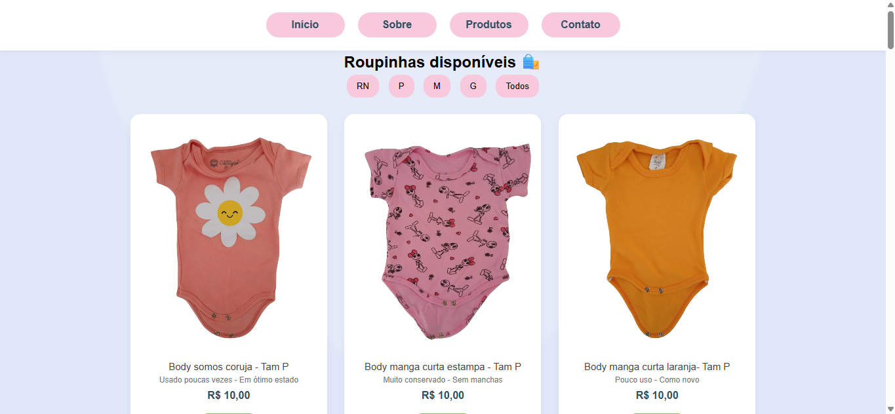

# 💕 Desapego da Cecília

Um site desenvolvido para divulgação e venda de roupinhas infantis em ótimo estado, com carinho e preço justo.

----------

## 🌸 Sobre o projeto

O **Desapego da Cecília** surgiu a partir de uma necessidade real: dar uma nova vida a roupinhas pouco usadas, mantendo qualidade e acessibilidade.

Este projeto foi desenvolvido como parte do meu aprendizado em desenvolvimento web, unindo prática técnica com um projeto real.

----------

## 🛍️ Funcionalidades

-   Página inicial com apresentação da marca
    
-   Página de produtos com imagens reais
    
-   Filtro por tamanho (RN, P, M e G) com JavaScript
    
-   Página "Sobre" com a história do projeto
    
-   Página de contato com informações de entrega e pagamento
    
-   Botão de contato via WhatsApp
    
-   Layout responsivo (adaptado para celular e desktop)
    

----------

## 💻 Tecnologias utilizadas

-   HTML5
    
-   CSS3
    
-   JavaScript
    

----------

## 📱 Responsividade

O site foi desenvolvido para funcionar corretamente em diferentes tamanhos de tela, garantindo uma boa experiência tanto em dispositivos móveis quanto em computadores.

----------

## 🎯 Objetivo

-   Praticar HTML, CSS e JavaScript
    
-   Criar um projeto real para portfólio
    
-   Desenvolver uma interface simples, bonita e funcional
    
-   Aplicar conceitos de responsividade
    

----------

## 📸 Prévia do projeto

### 🏠 Página inicial


### 🛍️ Produtos


### 📱 Versão mobile


----------

## 🚀 Como acessar

Após a publicação no GitHub Pages, o site poderá ser acessado pelo link:

👉 [https://SEU-USUARIO.github.io/desapego-cecilia](https://seu-usuario.github.io/desapego-cecilia)

----------

## 📦 Como executar o projeto localmente

```bash
git clone https://github.com/aracele-souza/desapego-cecilia

```

Depois, abra o arquivo **index.html** no navegador.

----------

## 💛 Diferencial

Este projeto não é apenas um exercício técnico, mas também uma aplicação real utilizada para divulgação e venda de produtos.

----------

## ✨ Desenvolvido por

Aracele Souza 💕